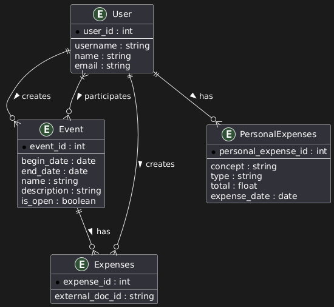

# Relational Database Documentation

This document describes the relational structure of the database used in the project. The model is designed to manage users, events, and expenses in a collaborative context.

## 🧩 Entity-Relationship Diagram

The following ER diagram illustrates the relationships between the entities:

> Generated with PlantUML

---

## 🗃️ Entities and Attributes

### 🧑 User

Represents a registered user in the system.

| Field      | Type     | Description             |
|------------|----------|-------------------------|
| `user_id`  | `int`    | Primary key             |
| `username` | `string` | Unique username         |
| `email`    | `string` | User email address      |
| `name`     | `string` | Full name of the user   |

---

### 📅 Event

Represents a scheduled or past event to which users are linked.

| Field        | Type     | Description              |
|--------------|----------|--------------------------|
| `event_id`   | `int`    | Primary key              |
| `begin_date` | `date`   | Start date of the event  |
| `end_date`   | `date`   | End date of the event    |
| `name`       | `string` | Name or title of event   |
| `description`| `string` | Event description        |
| `is_open`    | `boolean`| If event is open to receive participants |

---

### 💸 Expenses

Represents a shared expense linked to an event.

| Field             | Type     | Description                                |
|-------------------|----------|--------------------------------------------|
| `expense_id`      | `int`    | Primary key                                |
| `external_doc_id` | `string` | Reference to a document in the NoSQL store |

---

### 🧾 PersonalExpenses

Represents individual user expenses not directly tied to a specific event.

| Field                 | Type     | Description                  |
|-----------------------|----------|------------------------------|
| `personal_expense_id` | `int`    | Primary key                  |
| `concept`             | `string` | Description of the expense   |
| `type`                | `string` | Category/type of the expense |
| `total`               | `float`  | Total amount spent           |
| `expense_date`        | `date`   | Date related to expense      |

---

## 🔗 Relationships

- **User creates Event**  
  A user can create many events (`1:N`), but each event has only one creator.

- **User participates in Event**  
  A many-to-many relationship: multiple users can participate in multiple events.

- **Event has Expenses**  
  An event may have multiple related expenses (`1:N`), each tied to one event.

- **User creates Expenses**  
  A user can register multiple expenses; each expense is created by exactly one user.

- **User has PersonalExpenses**  
  A user may log multiple personal expenses not linked to events.

---

## 🛠️ Notes

- The `external_doc_id` in the `Expenses` table links to a document stored in a **NoSQL database** which contains the detailed expense record.