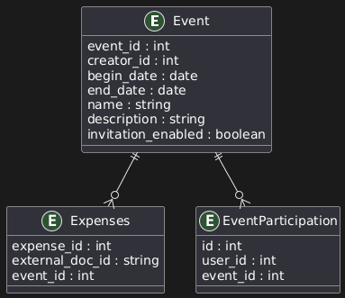

# 📄 Community Database Documentation

This document describes the relational database structure for managing community-related data such as events, shared expenses, and participation. The schema is defined in the `init.sql` file located in the `db/` directory.

---

## 🗃️ Database Overview

---

## 📅 Table: Event

Stores information about scheduled or past events.

| Field               | Type           | Constraints       | Description                             |
|--------------------|----------------|-------------------|-----------------------------------------|
| `event_id`         | `SERIAL`       | `PRIMARY KEY`     | Unique identifier for the event         |
| `creator_id`       | `INT`          | `NOT NULL`        | ID of the user who created the event    |
| `begin_date`       | `DATE`         | `NOT NULL`        | Start date of the event                 |
| `end_date`         | `DATE`         |                   | End date of the event (nullable)        |
| `name`             | `VARCHAR(100)` | `NOT NULL`        | Name or title of the event              |
| `description`      | `VARCHAR(255)` |                   | Optional event description              |
| `invitation_enabled` | `BOOLEAN`    | `DEFAULT FALSE`   | Whether others can join the event       |

---

## 💸 Table: Expenses

Stores shared expense records linked to events.

| Field             | Type           | Constraints       | Description                                 |
|------------------|----------------|-------------------|---------------------------------------------|
| `expense_id`     | `SERIAL`       | `PRIMARY KEY`     | Unique identifier for the expense           |
| `external_doc_id`| `VARCHAR(100)` |                   | Reference to a NoSQL document (external)    |
| `event_id`       | `INT`          | `NOT NULL`        | Foreign key referencing the related event   |

---

## 👥 Table: EventParticipation

Captures many-to-many relationships between users and events.

| Field      | Type     | Constraints       | Description                             |
|-----------|----------|-------------------|-----------------------------------------|
| `id`      | `SERIAL` | `PRIMARY KEY`     | Unique ID for the participation record  |
| `user_id` | `INT`    | `NOT NULL`        | ID of the user participating in event   |
| `event_id`| `INT`    | `NOT NULL`        | ID of the event                         |

> 🔗 Foreign key constraints to the `Users` table are noted but not enforced in this schema, to maintain microservice boundaries.

---

## 📦 Constraints and Rules

- Each event is created by a user (`creator_id`).
- Each expense must be associated with a valid event.
- Event participation supports multiple users per event and vice versa.

---

## 📂 Schema Location

The full SQL schema is located at:

`.\init-postgres.sql`

This file contains:
- Database creation (`CREATE DATABASE devpc`)
- Table definitions for `Event`, `Expenses`, and `EventParticipation`
- Foreign key references within the community domain

---

## 📌 Notes

- Foreign keys to the `Users` table are commented out to preserve service isolation.
- The `external_doc_id` in `Expenses` refers to documents stored in a separate NoSQL system.
- Composite primary keys and additional indexing may be added later depending on usage patterns.
