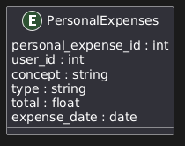

# 📄 Personal Expenses Database Documentation

This document outlines the relational database structure for managing individual (non-shared) expenses. The schema is defined in the `init.sql` file located in the `db/` directory.

---

## 🗃️ Database Overview

---

## 🧾 Table: PersonalExpenses

Stores records of personal expenses made by users, independent of any event.

| Field                 | Type           | Constraints       | Description                                  |
|----------------------|----------------|-------------------|----------------------------------------------|
| `personal_expense_id`| `SERIAL`       | `PRIMARY KEY`     | Unique identifier for the personal expense   |
| `user_id`            | `INT`          | `NOT NULL`        | ID of the user associated with the expense   |
| `concept`            | `VARCHAR(255)` | `NOT NULL`        | Description or concept of the expense        |
| `type`               | `VARCHAR(50)`  |                   | Category or type of the expense              |
| `total`              | `FLOAT`        | `NOT NULL`        | Total amount spent                           |
| `expense_date`       | `DATE`         | `NOT NULL`        | Date the expense was incurred                |

> 🔗 Foreign key constraint to the `Users` table is commented out for service decoupling.

---

## 📦 Constraints and Rules

- Every record is linked to a user via `user_id`.
- All fields except `type` are mandatory to ensure data integrity.
- Expense `type` can be standardized using ENUMs or a lookup table (not defined in current schema).

---

## 📂 Schema Location

The SQL schema is available at:

`.\init-postgres.sql`

This file contains:
- Database creation (`CREATE DATABASE devpp`)
- Table definition for `PersonalExpenses`

---

## 📌 Notes

- This table is designed for personal financial tracking, separate from shared event-related expenses.
- Foreign key enforcement to the `Users` table is omitted to preserve microservice independence.
