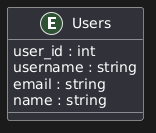

# 📄 Users Database Documentation

This document describes the relational database structure for managing user information in the system. The schema is defined in the `init.sql` file located in the `db/` directory.

---

## 🗃️ Database Overview

---

## 🧑 Table: Users

Stores core identity information for each user.

| Field      | Type          | Constraints               | Description                 |
|------------|---------------|---------------------------|-----------------------------|
| `user_id`  | `SERIAL`      | `PRIMARY KEY`             | Unique identifier for user  |
| `username` | `VARCHAR(50)` | `UNIQUE NOT NULL`         | User's login name           |
| `email`    | `VARCHAR(100)`| `UNIQUE NOT NULL`         | User's email address        |
| `name`     | `VARCHAR(100)`| `NOT NULL`                | Full name of the user       |

---

## 📦 Constraints and Rules

- `user_id` is the primary key and auto-increments.
- Both `username` and `email` must be unique across users.
- All fields are required (`NOT NULL`) to ensure data completeness.

---

## 📂 Schema Location

The SQL schema for setting up the database is available at:

`.\init-postgres.sql`

This file contains:
- Database creation (`CREATE DATABASE devpu`)
- Table definition (`CREATE TABLE Users`)
- Relevant constraints

---

## 📌 Notes

- Case sensitivity is enforced by default on `VARCHAR` fields.
- Additional fields such as timestamps or soft-delete flags may be added depending on future requirements.
